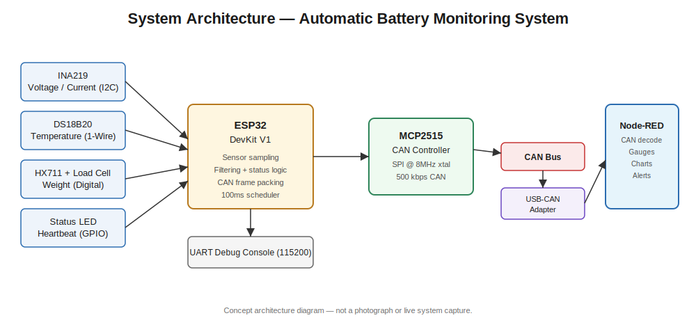
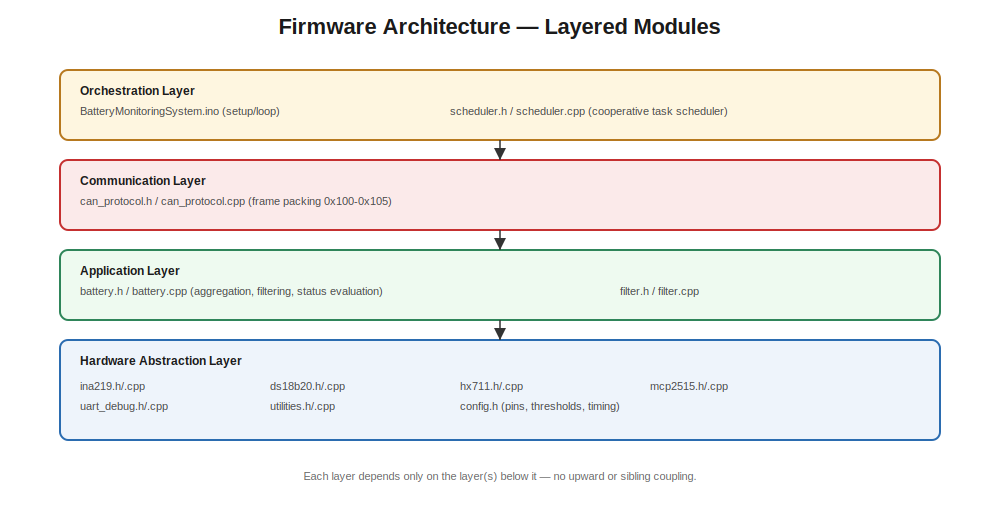
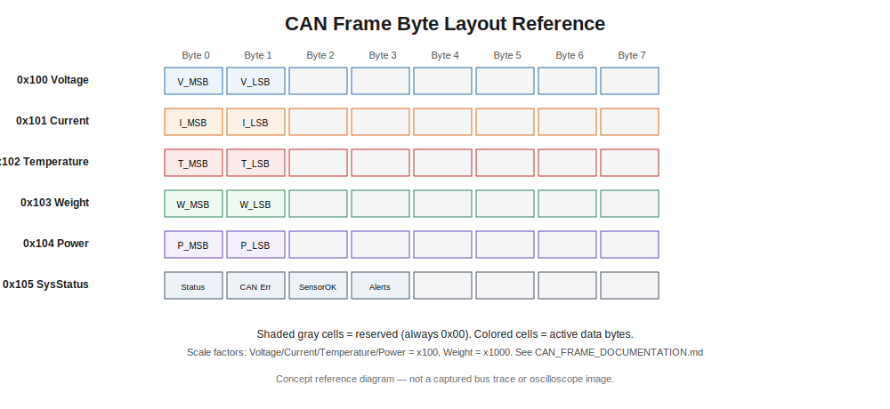

# Automatic Battery Monitoring System using CAN Bus and Node-RED



[](.github/workflows/firmware-ci.yml)
[](LICENSE)
[](docs/BUILD_INSTRUCTIONS.md)
[](docs/CAN_FRAME_DOCUMENTATION.md)
[](node-red/README.md)

A real-time embedded battery monitoring system built on the **ESP32**,
sampling voltage, current, temperature, and weight, broadcasting the
telemetry over **CAN bus at 500 kbps**, and visualizing it live on a
**Node-RED** dashboard.

> 📌 **Banner placeholder:** `images/banner.png` — see
> [`images/README.md`](images/README.md) for recommended photos/screenshots
> to add once hardware is assembled.

---

## Table of Contents

- [Overview](#overview)
- [Features](#features)
- [Hardware](#hardware)
- [Repository Structure](#repository-structure)
- [Architecture](#architecture)
- [CAN Frame Summary](#can-frame-summary)
- [Getting Started](#getting-started)
- [Node-RED Dashboard](#node-red-dashboard)
- [Documentation](#documentation)
- [Future Improvements](#future-improvements)
- [Contributing](#contributing)
- [Author](#author)
- [License](#license)

---

## Overview

The ESP32 samples an **INA219** (voltage/current), **DS18B20**
(temperature), and **HX711 + load cell** (weight) every 100 ms, applies
moving-average filtering, evaluates an overall battery status
(GOOD / WARNING / CRITICAL / FAULT), and transmits the results as six CAN
frames via an **MCP2515** controller. A **Node-RED** flow running on a
CAN-capable gateway decodes the frames and renders a live dashboard with
gauges, trend charts, and threshold-based alerts.

Full write-up: [`docs/PROJECT_DOCUMENTATION.md`](docs/PROJECT_DOCUMENTATION.md)

## Features

- ✅ Modular, layered embedded C/C++ firmware (Arduino framework)
- ✅ Non-blocking cooperative task scheduler (watchdog-friendly)
- ✅ Moving-average filtering on every sensor channel
- ✅ Configurable warning/critical thresholds
- ✅ Documented, compact CAN frame protocol (`0x100`–`0x105`)
- ✅ UART debug console with periodic telemetry snapshots
- ✅ Node-RED dashboard: gauges, trend charts, status LED, toast alerts
- ✅ GitHub Actions CI for firmware compilation and flow JSON validation

## Hardware

| Component              | Role                              |
|--------------------------|--------------------------------------|
| ESP32 DevKit V1           | Main microcontroller (SPI/I2C/1-Wire/UART) |
| MCP2515 + TJA1050         | CAN bus controller/transceiver (SPI)  |
| INA219                    | Voltage & current sensor (I2C)        |
| DS18B20                   | Temperature sensor (1-Wire)           |
| HX711 + Load Cell         | Weight sensing (digital)              |
| USB-CAN Adapter (host side)| Bridges CAN bus into Node-RED         |

Full wiring table: [`hardware/PIN_CONFIGURATION.md`](hardware/PIN_CONFIGURATION.md)

> 🖼️ **Hardware photo placeholders:** `images/hardware_photo_top.jpg`,
> `images/hardware_photo_wiring.jpg` — add real photos once assembled.

## Repository Structure

```
.
├── .github/                  CI workflows, issue & PR templates
├── datasheets/                Pointers to official component datasheets
├── docs/                      Full project documentation
├── firmware/                  ESP32 Arduino sketch + modular drivers
│   └── BatteryMonitoringSystem/
├── hardware/                  Pin configuration & wiring reference
├── images/                    Concept diagrams + image placeholders
├── node-red/                  Node-RED flow.json + dashboard README
├── simulations/                Reserved for circuit simulation artifacts
├── CHANGELOG.md
├── CITATION.cff
├── CODE_OF_CONDUCT.md
├── CONTRIBUTING.md
├── LICENSE
└── README.md                  You are here
```

## Architecture



```
Sensors (INA219 / DS18B20 / HX711) → ESP32 (filter + status logic)
    → MCP2515 (CAN 500kbps) → USB-CAN Adapter → Node-RED (decode + dashboard)
```

Detailed diagrams and layer descriptions:
[`docs/PROJECT_DOCUMENTATION.md`](docs/PROJECT_DOCUMENTATION.md#11-firmware-architecture)

## CAN Frame Summary

| Signal        | CAN ID  | Scale | Unit |
|---------------|---------|-------|------|
| Voltage       | `0x100` | ×100  | V    |
| Current       | `0x101` | ×100  | A    |
| Temperature   | `0x102` | ×100  | °C   |
| Weight        | `0x103` | ×1000 | kg   |
| Power         | `0x104` | ×100  | W    |
| System Status | `0x105` | n/a   | n/a  |

Full byte-level spec: [`docs/CAN_FRAME_DOCUMENTATION.md`](docs/CAN_FRAME_DOCUMENTATION.md)



## Getting Started

### 1. Flash the Firmware

```bash
# In Arduino IDE:
# Open firmware/BatteryMonitoringSystem/BatteryMonitoringSystem.ino
# Install required libraries (see docs/BUILD_INSTRUCTIONS.md)
# Select Board: "ESP32 Dev Module", select the correct Port
# Verify, then Upload
```

Full instructions: [`docs/BUILD_INSTRUCTIONS.md`](docs/BUILD_INSTRUCTIONS.md)

### 2. Wire the Hardware

Follow [`hardware/PIN_CONFIGURATION.md`](hardware/PIN_CONFIGURATION.md).

### 3. Bring Up the CAN Interface

```bash
sudo ip link set can0 type can bitrate 500000
sudo ip link set up can0
candump can0   # sanity check: frames 100-105 every ~100ms
```

### 4. Import the Node-RED Flow

```bash
npm install node-red-dashboard node-red-contrib-socketcan
```

Then, in the Node-RED editor: **Menu → Import → `node-red/flow.json` → Deploy**.

## Node-RED Dashboard

> 🖼️ **Dashboard screenshot placeholders:**
> `images/dashboard_screenshot_overview.png`,
> `images/dashboard_screenshot_trends.png` — capture from your running
> dashboard at `http://<host>:1880/ui`.

The dashboard includes:

- **Overview** — live gauges for Voltage, Current, Temperature, Weight,
  Power, plus a telemetry snapshot table.
- **Trends** — rolling 10-minute line charts for Voltage, Current,
  Temperature, and Power.
- **System Status & Alerts** — battery status text, CAN bus health LED, and
  toast notifications on threshold breach.

Details: [`node-red/README.md`](node-red/README.md) and
[`docs/NODE_RED_ARCHITECTURE.md`](docs/NODE_RED_ARCHITECTURE.md)

## Documentation

| Document | Description |
|----------|--------------|
| [`docs/PROJECT_DOCUMENTATION.md`](docs/PROJECT_DOCUMENTATION.md) | Full project write-up: objectives, architecture, testing, limitations |
| [`docs/BUILD_INSTRUCTIONS.md`](docs/BUILD_INSTRUCTIONS.md) | Step-by-step firmware build & flash guide |
| [`docs/CAN_FRAME_DOCUMENTATION.md`](docs/CAN_FRAME_DOCUMENTATION.md) | Byte-level CAN frame specification |
| [`docs/NODE_RED_ARCHITECTURE.md`](docs/NODE_RED_ARCHITECTURE.md) | Node-RED flow design rationale |
| [`hardware/PIN_CONFIGURATION.md`](hardware/PIN_CONFIGURATION.md) | Full wiring table & BOM |

## Future Improvements

- Per-cell voltage monitoring for multi-cell packs
- Historical data logging (InfluxDB / MongoDB) from Node-RED
- OTA firmware updates
- State-of-Charge (SoC) / State-of-Health (SoH) estimation
- Migration to ESP32's native TWAI controller
- Dashboard authentication for field deployments

Full list: [`docs/PROJECT_DOCUMENTATION.md`](docs/PROJECT_DOCUMENTATION.md#18-future-improvements)

## Contributing

Contributions are welcome! Please read [`CONTRIBUTING.md`](CONTRIBUTING.md)
and our [`CODE_OF_CONDUCT.md`](CODE_OF_CONDUCT.md) before submitting a pull
request.

## Author

Firmware, CAN protocol design, and Node-RED dashboard authored as part of
this repository's embedded systems reference implementation. See
[`CITATION.cff`](CITATION.cff) for citation details.

## License

Released under the [MIT License](LICENSE).
