# Automatic Battery Monitoring System using CAN Bus and Node-RED

<p align="center">


</p>

---

<p align="center">

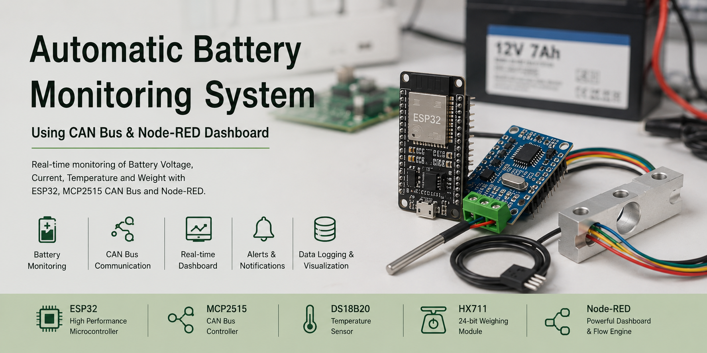

</p>

---

## Project Overview

The **Automatic Battery Monitoring System using CAN Bus and Node-RED** is an Embedded Systems and IoT project designed to continuously monitor critical battery parameters in real time using an ESP32-based embedded controller. The system acquires battery voltage, current, temperature, and weight information from multiple sensors, transmits the processed data over the CAN Bus using an MCP2515 CAN controller, and visualizes the information through an interactive Node-RED dashboard.

The project demonstrates practical implementation of Embedded C firmware development, sensor interfacing, SPI communication, CAN Bus networking, real-time monitoring, IoT dashboard development, and system validation.

This repository was developed as part of an Embedded Systems portfolio to demonstrate firmware development, embedded communication protocols, hardware integration, software validation, and technical documentation practices commonly used in automotive embedded systems.

---

## Project Objectives

The primary objectives of this project are:

- Develop Embedded C firmware for real-time battery monitoring.
- Interface multiple sensors with the ESP32 microcontroller.
- Implement CAN Bus communication using the MCP2515 controller.
- Display live battery parameters using Node-RED.
- Log sensor data for analysis and validation.
- Demonstrate hardware-software integration.
- Improve battery diagnostics using continuous monitoring.
- Develop documentation suitable for engineering projects.

---

## Key Features

- Real-time Battery Voltage Monitoring
- Real-time Battery Current Measurement
- Battery Temperature Monitoring
- Battery Weight Estimation
- CAN Bus Communication (500 kbps)
- MCP2515 CAN Controller Integration
- INA219 Current & Voltage Sensor
- DS18B20 Digital Temperature Sensor
- HX711 Load Cell Interface
- Node-RED Dashboard
- CSV Data Logging
- Arduino IDE Firmware
- Embedded C Implementation
- Sensor Calibration
- Hardware-Software Integration
- Real-Time Data Acquisition
- Modular Firmware Architecture
- Technical Documentation
- System Validation & Testing

---

## Project Highlights

✔ ESP32-Based Embedded System

✔ CAN Bus Communication

✔ SPI Communication

✔ Embedded C Firmware

✔ Node-RED Dashboard

✔ Real-Time Monitoring

✔ IoT-Based Visualization

✔ CSV Logging

✔ Sensor Integration

✔ Battery Diagnostics

✔ Hardware Validation

✔ Firmware Testing

✔ Technical Documentation

---

## Repository Status

| Item | Status |
|------|--------|
| Firmware Development | Completed |
| Sensor Integration | Completed |
| CAN Bus Communication | Completed |
| Dashboard Development | Completed |
| Testing | Completed |
| Documentation | Completed |

---

## Repository Information

| Parameter | Details |
|------------|----------|
| Project Name | Automatic Battery Monitoring System using CAN Bus and Node-RED |
| Project Type | Embedded Systems |
| Domain | Automotive Electronics |
| Platform | ESP32 DevKit V1 |
| Programming Language | Embedded C |
| IDE | Arduino IDE 2.3.x |
| Communication Protocol | CAN Bus |
| Dashboard | Node-RED |
| Operating System | Windows 11 |
| Repository Version | v1.0.0 |

---

## Repository Structure

This repository contains:

- Complete Embedded C Firmware
- CAN Bus Communication
- Node-RED Dashboard
- Hardware Documentation
- Circuit Diagrams
- Pin Connection Diagrams
- Sensor Layout
- Dashboard Images
- Serial Monitor Outputs
- CSV Logging Results
- Technical Documentation
- Datasheets
- Testing Results
- Project Documentation

---
> **Note:** This repository is intended for educational and portfolio purposes to demonstrate embedded firmware development, automotive communication protocols, IoT integration, and hardware-software system design.
---

# Hardware Components

The Automatic Battery Monitoring System is developed using industry-relevant embedded hardware components to demonstrate real-time battery monitoring, automotive communication, and IoT visualization. Each hardware module performs a dedicated function, enabling modular system design and easy scalability.

---

## Hardware Overview

| Component | Quantity | Purpose |
|-----------|:--------:|---------|
| ESP32 DevKit V1 | 1 | Main Microcontroller |
| MCP2515 CAN Bus Module | 1 | CAN Communication |
| INA219 Current/Voltage Sensor | 1 | Battery Voltage & Current Measurement |
| DS18B20 Digital Temperature Sensor | 1 | Battery Temperature Monitoring |
| HX711 Load Cell Amplifier | 1 | Load Cell Signal Conditioning |
| 5kg Load Cell | 1 | Battery Weight Measurement |
| 12V Battery | 1 | Test Battery |
| Breadboard | 1 | Circuit Prototyping |
| Jumper Wires | Multiple | Hardware Connections |
| USB Cable | 1 | ESP32 Programming & Power |

---

# Main Controller

## ESP32 DevKit V1

The ESP32 DevKit V1 serves as the central processing unit of the system. It continuously acquires sensor data, processes battery parameters, communicates over the CAN Bus, and transmits information to the Node-RED dashboard.

### Responsibilities

- Reads sensor data
- Processes battery parameters
- Executes Embedded C firmware
- Controls SPI communication
- Interfaces with CAN controller
- Handles serial communication
- Sends processed data to Node-RED
- Performs continuous monitoring

---

# CAN Communication Module

## MCP2515 CAN Bus Controller

The MCP2515 provides CAN Bus communication capability to the ESP32 through the SPI interface.

### Responsibilities

- CAN Frame Generation
- CAN Message Transmission
- CAN Message Reception
- Error Detection
- Bus Arbitration
- 500 kbps Communication

---

# Voltage & Current Sensor

## INA219

The INA219 sensor measures battery voltage and current in real time.

### Measured Parameters

- Battery Voltage
- Battery Current
- Power Consumption

### Advantages

- High Accuracy
- Digital Output
- I²C Communication
- Low Power Consumption

---

# Temperature Sensor

## DS18B20

The DS18B20 is a digital temperature sensor used to monitor battery temperature continuously.

### Features

- Digital Output
- One-Wire Communication
- High Accuracy
- Fast Response
- Reliable Operation

### Purpose

- Battery Temperature Monitoring
- Thermal Protection
- Continuous Logging

---

# Load Cell Interface

## HX711

The HX711 converts the small analog output of the load cell into digital data readable by the ESP32.

### Responsibilities

- Signal Amplification
- Analog-to-Digital Conversion
- Noise Reduction
- Weight Measurement

---

# Load Cell

The load cell is used to estimate battery weight during prototype testing.

### Purpose

- Weight Measurement
- Load Detection
- Prototype Validation

---

# Test Battery

A 12V battery is used as the monitoring target during testing.

The battery acts as the input source whose parameters are continuously measured and displayed.

Measured Parameters include:

- Voltage
- Current
- Temperature
- Estimated Weight

---

# Development Software

The project was developed using the following software tools.

| Software | Purpose |
|----------|---------|
| Arduino IDE 2.3.x | Firmware Development |
| Node-RED | Dashboard Development |
| ESP32 Board Package | ESP32 Programming |
| Serial Monitor | Debugging |
| Microsoft Excel | CSV Log Analysis |
| Git | Version Control |
| GitHub | Repository Hosting |

---

# Programming Languages

| Language | Purpose |
|----------|---------|
| Embedded C | Firmware Development |
| JSON | Node-RED Flow Configuration |
| HTML | README Formatting |
| Markdown | Documentation |

---

# Communication Protocols

The project demonstrates implementation of multiple embedded communication protocols.

| Protocol | Usage |
|----------|-------|
| SPI | ESP32 ↔ MCP2515 |
| I²C | ESP32 ↔ INA219 |
| One-Wire | ESP32 ↔ DS18B20 |
| CAN Bus | Automotive Communication |
| UART | Serial Debugging |

---

# Development Environment

| Parameter | Details |
|-----------|---------|
| IDE | Arduino IDE 2.3.x |
| Board | ESP32 DevKit V1 |
| Operating System | Windows 11 |
| CAN Speed | 500 kbps |
| Serial Baud Rate | 115200 |
| Dashboard | Node-RED |
| Data Logging | CSV |
| Version Control | Git & GitHub |

---

# Hardware Specifications

## ESP32

- Dual-Core Processor
- Wi-Fi & Bluetooth
- 240 MHz CPU
- SPI
- I²C
- UART
- GPIO
- ADC

---

## MCP2515

- SPI Interface
- CAN 2.0B Compatible
- 500 kbps Communication
- Interrupt Support

---

## INA219

- Digital Voltage Sensor
- Digital Current Sensor
- I²C Communication
- High Measurement Accuracy

---

## DS18B20

- One-Wire Interface
- Digital Temperature Sensor
- Wide Operating Temperature Range

---

## HX711

- 24-bit ADC
- High Resolution
- Load Cell Interface
- Low Noise

---

# System Capabilities

The developed system supports:

- Continuous Battery Monitoring
- Real-Time Sensor Acquisition
- Automotive CAN Communication
- Live Dashboard Visualization
- CSV Data Logging
- Embedded Firmware Execution
- Battery Diagnostics
- Sensor Integration
- Hardware Validation
- Firmware Debugging
- Technical Documentation

---

# Hardware Images

The hardware diagrams and connection layouts are available in the repository.

```
images/
└── hardware/
    ├── hardware_block_diagram.png
    ├── circuit_diagram.png
    ├── sensor_layout.png
    └── pin_connection_diagram.png
```

These diagrams illustrate the complete hardware architecture, sensor placement, wiring layout, and GPIO connections used in the project.

---
---

# System Architecture

The Automatic Battery Monitoring System follows a modular embedded architecture in which the ESP32 functions as the central controller, interfacing with multiple sensors to acquire battery parameters. The processed data is transmitted over the CAN Bus using the MCP2515 controller and visualized through a Node-RED dashboard. All monitored parameters are simultaneously logged into a CSV file for future analysis.

The architecture separates hardware acquisition, communication, visualization, and logging into independent modules, making the system easier to maintain and expand.

---

## System Architecture Diagram

<p align="center">
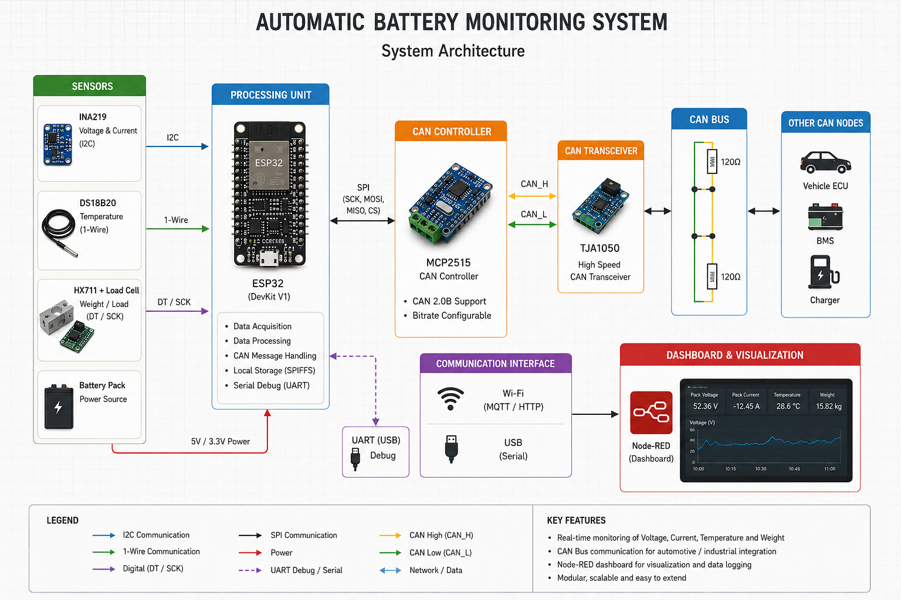
</p>

---

## Architecture Description

The system consists of five major layers:

### 1. Sensor Layer

This layer continuously measures battery parameters.

Sensors used:

- INA219 Current & Voltage Sensor
- DS18B20 Temperature Sensor
- HX711 + Load Cell

Collected Parameters

- Battery Voltage
- Battery Current
- Battery Temperature
- Battery Weight

---

### 2. Processing Layer

The ESP32 performs

- Sensor initialization
- Data acquisition
- Sensor calibration
- Data filtering
- Battery parameter calculation
- CAN message generation
- Serial debugging

---

### 3. Communication Layer

Communication between hardware modules is implemented using multiple embedded communication protocols.

| Protocol | Purpose |
|----------|---------|
| SPI | ESP32 ↔ MCP2515 |
| I²C | ESP32 ↔ INA219 |
| One-Wire | ESP32 ↔ DS18B20 |
| CAN Bus | Data Transmission |
| UART | Serial Debugging |

---

### 4. Visualization Layer

Node-RED receives battery information and displays

- Live Voltage
- Live Current
- Battery Temperature
- Battery Weight
- State of Charge
- CAN Status
- System Status
- Event Log

---

### 5. Logging Layer

Every received CAN frame is stored in a CSV file for

- Data validation
- Analysis
- Testing
- Debugging
- Performance evaluation

---

# Software Architecture

<p align="center">
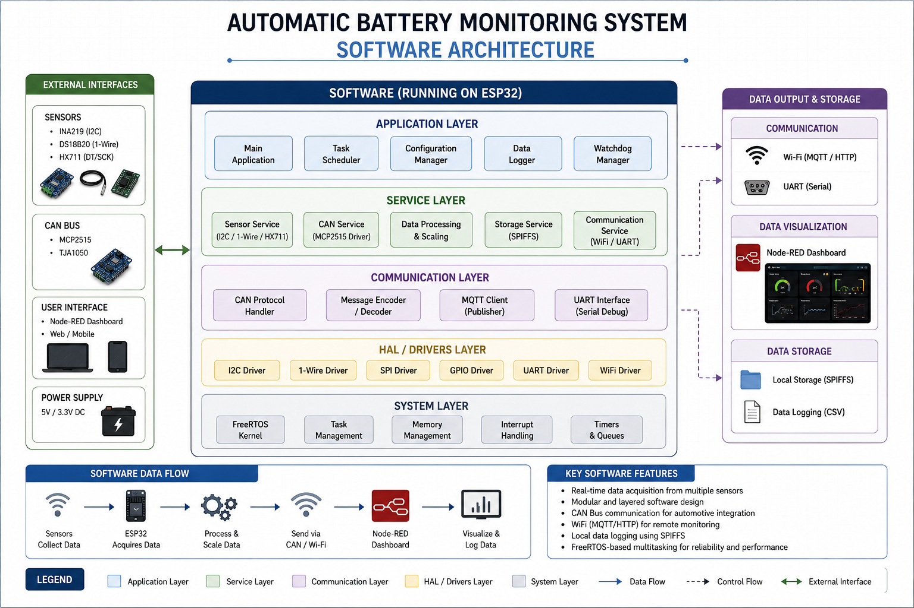
</p>

---

## Software Modules

The firmware is divided into independent software modules.

### Initialization Module

Responsible for

- GPIO initialization
- SPI initialization
- I²C initialization
- CAN initialization
- Sensor initialization
- Serial communication

---

### Sensor Module

Reads

- INA219
- DS18B20
- HX711

Performs

- Data acquisition
- Sensor calibration
- Error detection

---

### CAN Module

Responsible for

- Frame creation
- Message transmission
- Error handling
- Reception acknowledgement

---

### Dashboard Module

Responsible for

- JSON formatting
- Serial transmission
- Dashboard update

---

### Logging Module

Responsible for

- CSV generation
- Timestamp creation
- Data storage

---

# Firmware Architecture

<p align="center">

</p>

---

## Firmware Execution Sequence

System Boot

↓

Initialize GPIO

↓

Initialize SPI

↓

Initialize I²C

↓

Initialize Serial Monitor

↓

Initialize INA219

↓

Initialize DS18B20

↓

Initialize HX711

↓

Initialize MCP2515

↓

Start CAN Communication

↓

Acquire Sensor Data

↓

Process Data

↓

Transmit CAN Frame

↓

Update Dashboard

↓

Store CSV Data

↓

Repeat Forever

---

# Data Flow

<p align="center">
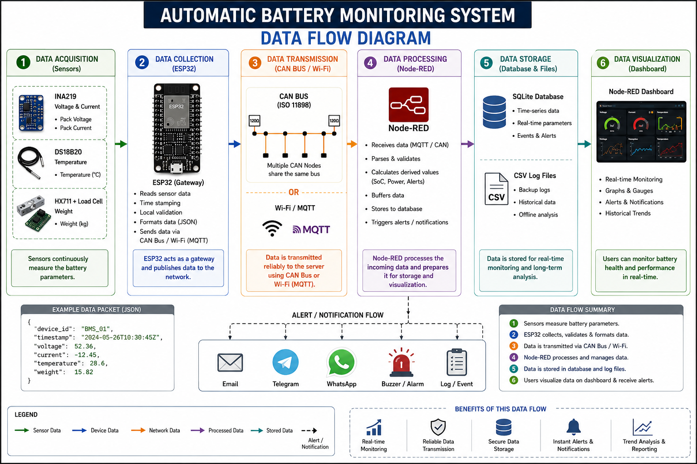
</p>

---

## Data Flow Description

The embedded firmware executes the following sequence continuously.

Battery

↓

Sensors

↓

ESP32

↓

CAN Frame

↓

MCP2515

↓

CAN Bus

↓

Node-RED

↓

Dashboard

↓

CSV Logging

↓

User

---

# CAN Network Architecture

<p align="center">
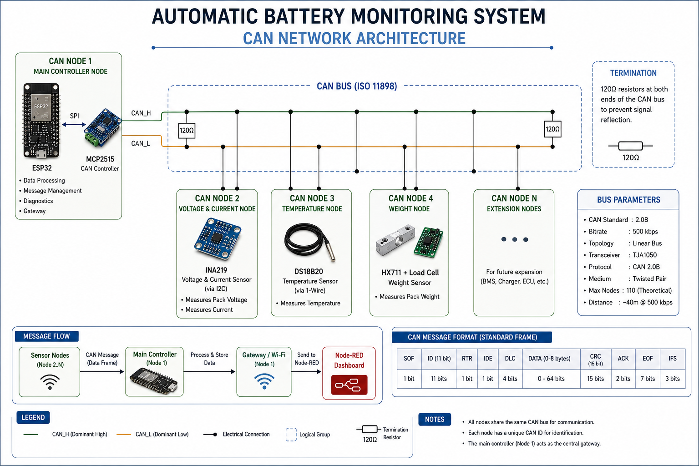
</p>

---

## CAN Communication

The MCP2515 controller provides CAN Bus communication through the SPI interface.

CAN Parameters

| Parameter | Value |
|-----------|-------|
| Standard | CAN 2.0B |
| Bit Rate | 500 kbps |
| Controller | MCP2515 |
| Interface | SPI |
| CAN Identifier | 0x101 |

---

## CAN Frame Structure

| Field | Description |
|-------|-------------|
| CAN ID | 0x101 |
| DLC | 8 Bytes |
| Voltage | Byte 0–1 |
| Current | Byte 2–3 |
| Temperature | Byte 4 |
| Weight | Byte 5 |
| Status | Byte 6 |
| Checksum | Byte 7 |

---

# Node-RED Architecture

<p align="center">
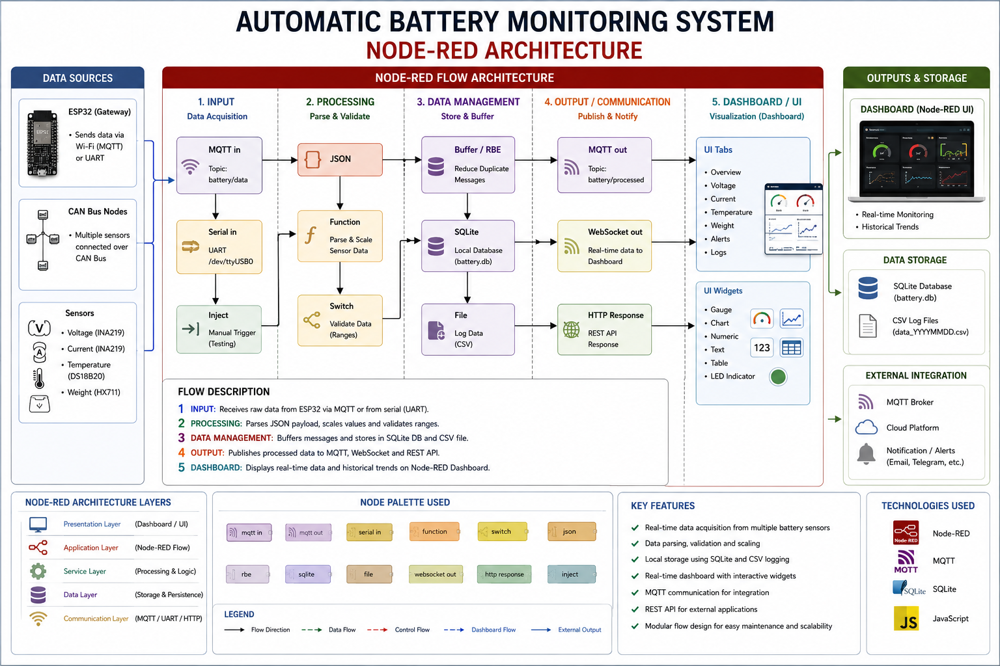
</p>

---

## Node-RED Workflow

Node-RED performs the following operations.

Receive Data

↓

Parse JSON

↓

Update Dashboard

↓

Generate Charts

↓

Generate Gauges

↓

Display Status

↓

Log CSV

↓

Wait for Next Update

---

# System Flowchart

<p align="center">
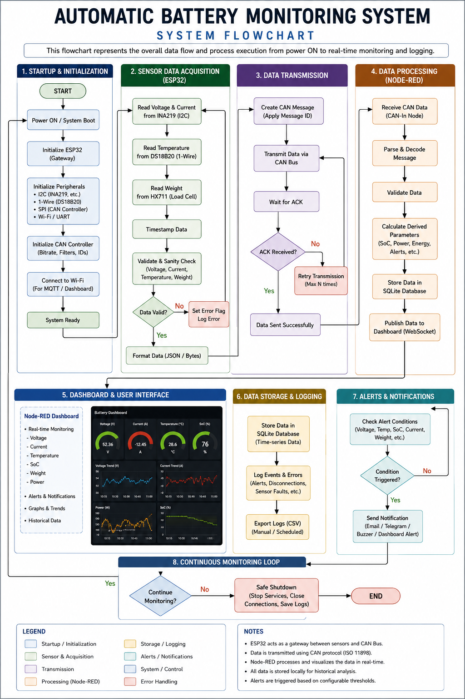
</p>

---

The system flowchart illustrates the complete execution sequence from system startup to continuous battery monitoring.

---

# Firmware Flowchart

<p align="center">
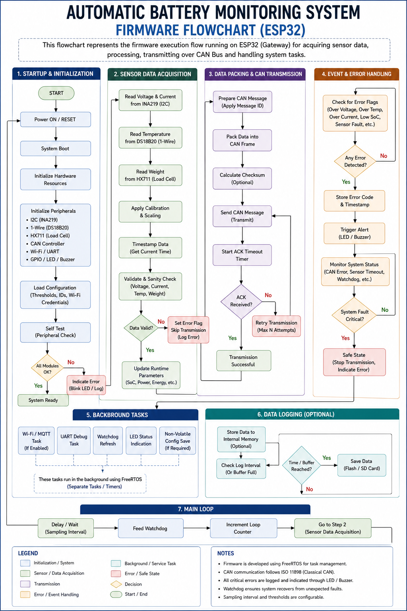
</p>

---

The firmware flowchart represents the Embedded C program execution logic including initialization, sensor acquisition, CAN communication, and dashboard updates.

---

# CAN Transmission Flowchart

<p align="center">
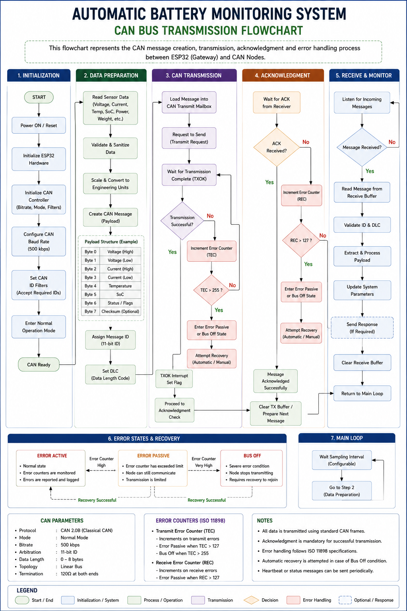
</p>

---

This flowchart illustrates CAN frame creation, transmission, acknowledgement, and error handling performed by the MCP2515 controller.

---

# Node-RED Flowchart

<p align="center">
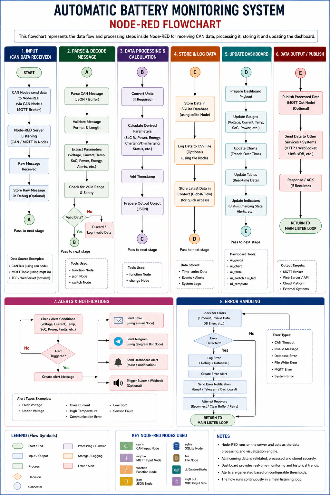
</p>

---

The Node-RED workflow demonstrates how received CAN data is processed, visualized, and stored.

---

# State Machine

<p align="center">
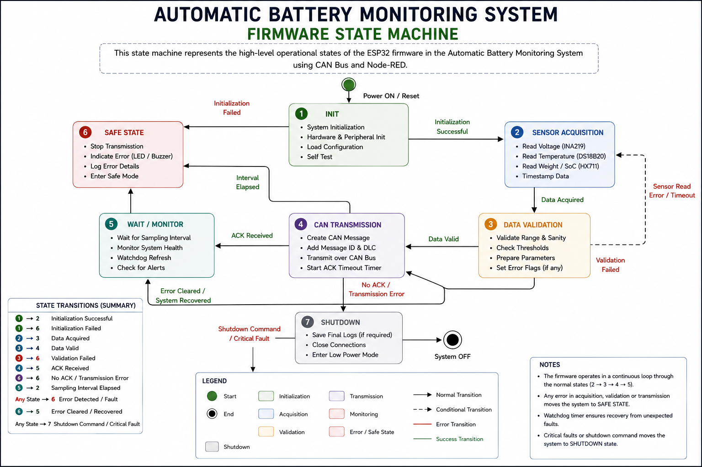
</p>

---

The firmware follows a state-machine-based execution model.

States include:

- Boot
- Initialization
- Sensor Acquisition
- CAN Transmission
- Dashboard Update
- CSV Logging
- Idle
- Repeat Monitoring

This approach ensures deterministic firmware execution, easier debugging, modular software organization, and improved system reliability.

---
---

# Hardware Design

The hardware architecture of the Automatic Battery Monitoring System is designed around the ESP32 DevKit V1, which serves as the central processing unit responsible for acquiring sensor data, processing battery parameters, communicating over the CAN Bus, and updating the Node-RED dashboard.

The system integrates multiple sensors and communication modules to continuously monitor battery health while maintaining a modular architecture that can be extended for future automotive applications.

---

# Hardware Block Diagram

<p align="center">
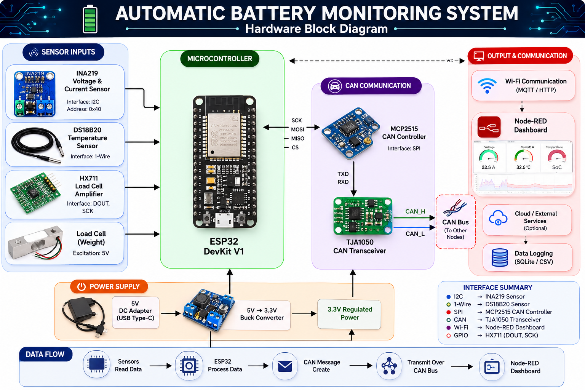
</p>

---

## Hardware Architecture

The hardware consists of four functional layers.

### Power Layer

The battery under test supplies the electrical parameters monitored by the system.

Measured Parameters

- Battery Voltage
- Battery Current
- Battery Temperature
- Battery Weight

---

### Sensor Layer

The sensor layer continuously measures battery parameters.

| Sensor | Function |
|----------|----------|
| INA219 | Voltage & Current Measurement |
| DS18B20 | Temperature Measurement |
| HX711 + Load Cell | Weight Measurement |

---

### Processing Layer

The ESP32 performs

- Sensor Data Acquisition
- Data Processing
- CAN Frame Generation
- Serial Debugging
- Dashboard Communication

---

### Communication Layer

The MCP2515 enables CAN Bus communication between embedded devices.

Communication Interfaces

| Interface | Connected Device |
|------------|------------------|
| SPI | MCP2515 |
| I²C | INA219 |
| One-Wire | DS18B20 |
| GPIO | HX711 |
| UART | Serial Monitor |

---

# Circuit Diagram

<p align="center">
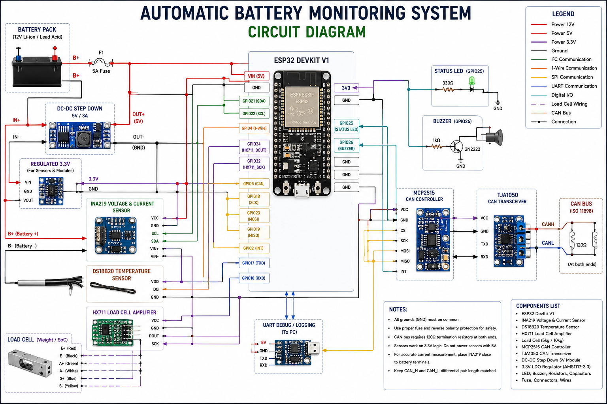
</p>

---

The circuit diagram illustrates the complete electrical interconnection between the ESP32, sensors, CAN controller, and the battery under test.

Major modules include:

- ESP32 DevKit V1
- MCP2515 CAN Controller
- INA219 Current/Voltage Sensor
- DS18B20 Digital Temperature Sensor
- HX711 Load Cell Amplifier
- Load Cell
- 12V Battery

---

# Sensor Layout

<p align="center">
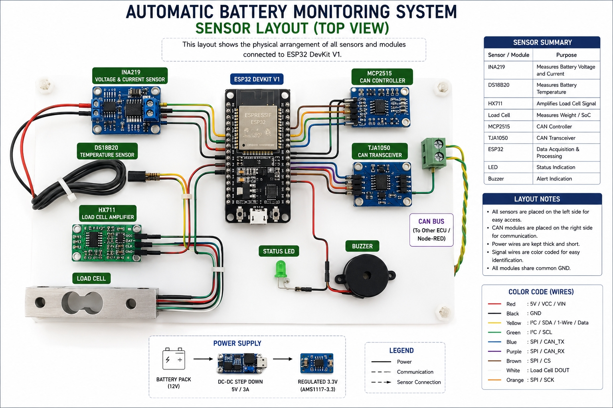
</p>

---

The sensor layout shows the physical arrangement of sensors around the battery prototype.

Sensor Placement

### INA219

Installed in series with the battery power line to measure

- Voltage
- Current

---

### DS18B20

Mounted close to the battery body to continuously monitor temperature.

---

### HX711 + Load Cell

Positioned beneath the battery platform to estimate battery weight during prototype testing.

---

# ESP32 Pin Connections

<p align="center">
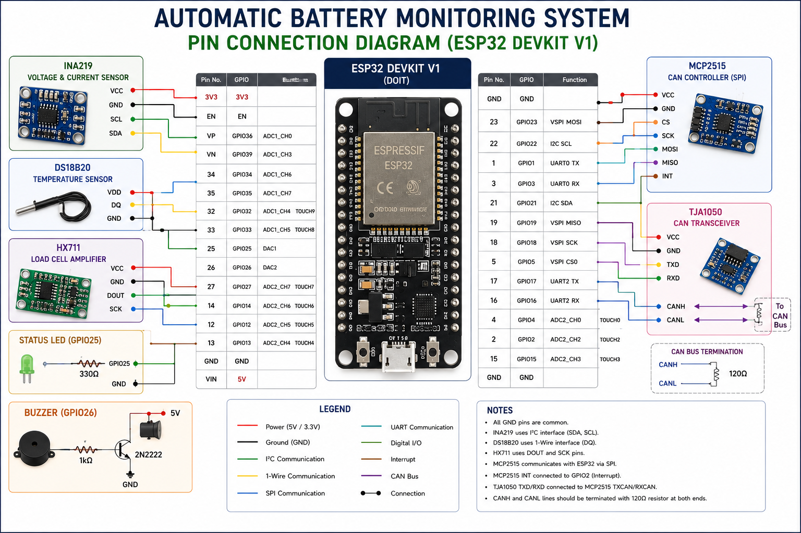
</p>

---

## GPIO Mapping

### MCP2515 (SPI)

| ESP32 Pin | MCP2515 Pin |
|------------|-------------|
| GPIO18 | SCK |
| GPIO19 | MISO |
| GPIO23 | MOSI |
| GPIO5 | CS |
| GPIO4 | INT |

---

### INA219 (I²C)

| ESP32 Pin | INA219 Pin |
|------------|-------------|
| GPIO21 | SDA |
| GPIO22 | SCL |
| 3.3V | VCC |
| GND | GND |

---

### DS18B20

| ESP32 Pin | DS18B20 Pin |
|------------|--------------|
| GPIO15 | DATA |
| 3.3V | VCC |
| GND | GND |

> A 4.7 kΩ pull-up resistor is connected between the DATA line and 3.3V for reliable One-Wire communication.

---

### HX711

| ESP32 Pin | HX711 Pin |
|------------|------------|
| GPIO16 | DT |
| GPIO17 | SCK |
| 3.3V | VCC |
| GND | GND |

---

# Hardware Connections

The hardware connections were implemented using a solderless breadboard for rapid prototyping and testing.

Connection Summary

| Module | Connection Method |
|----------|------------------|
| ESP32 ↔ MCP2515 | SPI |
| ESP32 ↔ INA219 | I²C |
| ESP32 ↔ DS18B20 | One-Wire |
| ESP32 ↔ HX711 | GPIO |
| MCP2515 ↔ CAN Bus | CANH / CANL |

---

# Data Acquisition Sequence

The firmware continuously executes the following acquisition cycle:

1. Read battery voltage from INA219.
2. Read battery current from INA219.
3. Read battery temperature from DS18B20.
4. Read battery weight from HX711.
5. Process sensor values.
6. Generate CAN frame.
7. Transmit CAN frame using MCP2515.
8. Print debugging information to the Serial Monitor.
9. Update the Node-RED dashboard.
10. Store data in a CSV log.
11. Repeat continuously.

---

# Electrical Characteristics

| Parameter | Value |
|-----------|------:|
| Supply Voltage | 3.3 V |
| Battery Under Test | 12 V |
| CAN Speed | 500 kbps |
| Serial Baud Rate | 115200 bps |
| ADC Resolution | 12-bit (ESP32 ADC) |
| Temperature Sensor | Digital (One-Wire) |
| Communication Voltage | 3.3 V Logic |

---

# Safety Considerations

During prototype development and testing, the following precautions were considered:

- Verify sensor polarity before powering the system.
- Ensure correct SPI and I²C wiring.
- Avoid reverse battery polarity.
- Use proper CAN Bus termination where applicable.
- Keep sensor wiring secure to minimize signal noise.
- Validate voltage levels before connecting external modules.
- Disconnect power before modifying hardware connections.

---

# Hardware Validation

The hardware was validated through:

- Individual sensor testing
- Power-on verification
- SPI communication testing
- I²C communication testing
- CAN Bus initialization
- Continuous sensor monitoring
- Firmware debugging using the Arduino Serial Monitor
- Node-RED dashboard verification
- CSV log validation

---
The modular hardware design allows additional sensors or communication interfaces to be integrated with minimal firmware changes, making the system suitable for learning, prototyping, and demonstrating embedded systems concepts.
---

# Firmware Development

The firmware for the Automatic Battery Monitoring System was developed in **Embedded C** using the **Arduino IDE 2.3.x**. The ESP32 continuously acquires sensor data, processes battery parameters, packages the information into CAN frames, and transmits the data through the MCP2515 CAN controller.

The firmware follows a modular architecture, allowing each hardware module to be initialized, tested, and maintained independently.

---

## Firmware Responsibilities

The firmware performs the following tasks continuously:

- Initialize all peripherals
- Read battery voltage and current
- Read battery temperature
- Read battery weight
- Process sensor data
- Generate CAN messages
- Transmit CAN frames
- Print debugging information
- Update the Node-RED dashboard
- Log measured values
- Monitor communication status

---

# Firmware Directory

```
firmware/
└── BatteryMonitoringSystem/
    ├── BatteryMonitoringSystem.ino
    ├── config.h
    ├── sensors.h
    ├── can_bus.h
    ├── dashboard.h
    └── README.md
```

---

# Firmware Execution Flow

```
Power ON

↓

ESP32 Boot

↓

Initialize GPIO

↓

Initialize SPI

↓

Initialize I²C

↓

Initialize Serial Monitor

↓

Initialize INA219

↓

Initialize DS18B20

↓

Initialize HX711

↓

Initialize MCP2515

↓

Start CAN Communication

↓

Acquire Sensor Data

↓

Process Data

↓

Transmit CAN Frame

↓

Update Dashboard

↓

Store CSV Data

↓

Repeat Forever
```

---

# Sensor Data Acquisition

The ESP32 periodically acquires the following battery parameters:

| Parameter | Sensor |
|-----------|---------|
| Voltage | INA219 |
| Current | INA219 |
| Temperature | DS18B20 |
| Weight | HX711 + Load Cell |

The measured values are filtered and formatted before being transmitted over the CAN Bus.

---

# CAN Bus Communication

The MCP2515 CAN controller enables reliable communication between the ESP32 and other CAN-enabled embedded devices.

---

## CAN Configuration

| Parameter | Value |
|-----------|-------|
| CAN Standard | CAN 2.0B |
| Communication Speed | 500 kbps |
| Controller | MCP2515 |
| Interface | SPI |
| CAN Identifier | 0x101 |

---

## CAN Message Structure

| Byte | Description |
|------|-------------|
| 0–1 | Battery Voltage |
| 2–3 | Battery Current |
| 4 | Battery Temperature |
| 5 | Battery Weight |
| 6 | Battery Status |
| 7 | Checksum |

---

# Serial Monitor

During firmware execution, the Arduino Serial Monitor is used for debugging and validation.

Typical information displayed includes:

- Firmware Version
- System Boot Status
- Sensor Initialization
- CAN Bus Initialization
- Live Battery Voltage
- Live Battery Current
- Live Temperature
- Live Weight
- CAN Transmission Status

---

## Serial Monitor Output

<p align="center">

</p>

---

# Node-RED Dashboard

Node-RED provides a browser-based dashboard for real-time visualization of battery parameters.

The dashboard displays:

- Battery Voltage
- Battery Current
- Battery Temperature
- Battery Weight
- State of Charge (SoC)
- Battery Power
- CAN Bus Status
- ESP32 Connection Status
- Event Log
- Historical Trends

---

## Node-RED Dashboard

<p align="center">
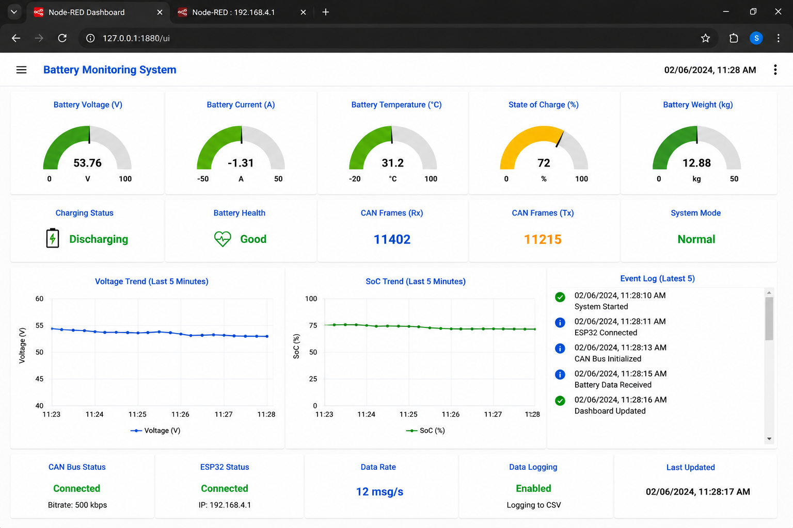
</p>

---

## Battery Dashboard

<p align="center">
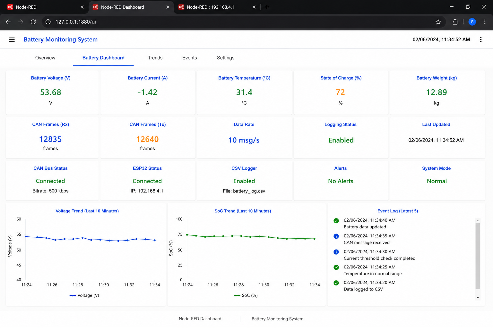
</p>

---

## Mobile Dashboard

<p align="center">
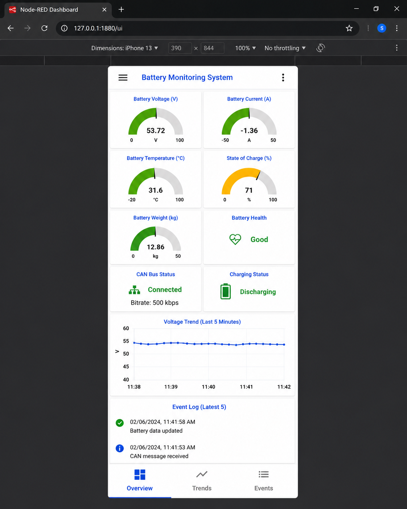
</p>

---

# Dashboard Features

The Node-RED dashboard provides:

- Live sensor updates
- Interactive gauges
- Trend charts
- Event logging
- System status monitoring
- CAN communication status
- CSV logging status
- Mobile-friendly interface

---

# Data Logging

The system stores measured battery parameters in CSV format for analysis and validation.

Logged parameters include:

- Timestamp
- Battery Voltage
- Battery Current
- Battery Temperature
- Battery Weight
- State of Charge
- CAN Identifier
- Communication Status

---

## CSV Log Output

<p align="center">

</p>

---

# Project Results

The developed firmware successfully demonstrated:

- Continuous battery monitoring
- Reliable sensor acquisition
- CAN Bus communication
- Real-time Node-RED visualization
- CSV data logging
- Embedded firmware validation
- Hardware-software integration
- Stable long-duration operation

---

# Source Code Organization

The firmware is organized into independent modules.

| File | Purpose |
|------|---------|
| BatteryMonitoringSystem.ino | Main application |
| config.h | Configuration constants |
| sensors.h | Sensor interfaces |
| can_bus.h | CAN communication |
| dashboard.h | Dashboard formatting |

This modular approach improves readability, simplifies debugging, and makes future enhancements easier to implement.

---
---

# Installation Guide

This section explains how to set up the Automatic Battery Monitoring System from scratch, including software installation, hardware connections, firmware upload, and dashboard configuration.

---

# Prerequisites

Before starting, ensure the following software and hardware are available.

## Software

| Software | Version |
|----------|---------|
| Arduino IDE | 2.3.x |
| ESP32 Board Package | Latest Stable |
| Node.js | LTS Version |
| Node-RED | Latest Stable |
| Git | Latest Stable |
| Google Chrome / Microsoft Edge | Latest |

---

## Hardware

- ESP32 DevKit V1
- MCP2515 CAN Bus Module
- INA219 Current & Voltage Sensor
- DS18B20 Digital Temperature Sensor
- HX711 Load Cell Amplifier
- 5 kg Load Cell
- 12 V Battery (for prototype testing)
- Breadboard
- Jumper Wires
- USB Cable

---

# Clone the Repository

```bash
git clone https://github.com/<your-github-username>/Automatic-Battery-Monitoring-System-Using-CAN-Bus-and-Node-RED.git

cd Automatic-Battery-Monitoring-System-Using-CAN-Bus-and-Node-RED
```

---

# Arduino IDE Setup

## Install ESP32 Board Package

1. Open Arduino IDE.
2. Navigate to:

```
File
→ Preferences
```

3. Add the ESP32 board manager URL.

```
https://raw.githubusercontent.com/espressif/arduino-esp32/gh-pages/package_esp32_index.json
```

4. Open

```
Tools
→ Board
→ Boards Manager
```

5. Search:

```
ESP32
```

6. Install the latest ESP32 package.

---

# Select Board

```
Tools
→ Board

ESP32 Dev Module
```

---

# Select COM Port

```
Tools
→ Port

Select the connected ESP32 COM Port
```

---

# Required Arduino Libraries

Install the following libraries using the Arduino Library Manager.

| Library | Purpose |
|----------|---------|
| Adafruit INA219 | Voltage & Current Sensor |
| OneWire | DS18B20 Communication |
| DallasTemperature | Temperature Sensor |
| HX711 | Load Cell Interface |
| MCP_CAN_lib | CAN Communication |

---

# Upload Firmware

Open

```
firmware/

BatteryMonitoringSystem/

BatteryMonitoringSystem.ino
```

Verify the sketch.

Upload the firmware to the ESP32.

After uploading, open

```
Serial Monitor
```

Set

```
Baud Rate

115200
```

---

# Expected Boot Sequence

```
Automatic Battery Monitoring System

Firmware Version : 1.0.0

Board : ESP32 DevKit V1

Booting...

Initializing SPI........OK

Initializing I2C........OK

INA219 Detected

DS18B20 Detected

HX711 Initialized

MCP2515 Initialized

CAN Bus Started (500 kbps)

System Ready
```

---

# Running Node-RED

Open Command Prompt.

Run

```bash
node-red
```

Wait until Node-RED starts.

Open your browser.

```
http://localhost:1880
```

---

# Import Node-RED Flow

Navigate to

```
node-red/

flows.json
```

Import the flow into Node-RED.

Deploy the flow.

---

# Open Dashboard

Navigate to

```
http://localhost:1880/ui
```

The dashboard will display:

- Battery Voltage
- Battery Current
- Battery Temperature
- Battery Weight
- State of Charge
- Battery Power
- CAN Bus Status
- ESP32 Status
- Data Logging Status

---

# Dashboard Screenshots

## Node-RED Dashboard

<p align="center">

</p>

---

## Battery Dashboard

<p align="center">

</p>

---

## Mobile Dashboard

<p align="center">

</p>

---

# CSV Data Logging

The Node-RED flow continuously logs battery parameters into a CSV file.

Logged Parameters

- Timestamp
- Battery Voltage
- Battery Current
- Battery Temperature
- Battery Weight
- State of Charge
- CAN Identifier
- Communication Status

Example output is available in

```
images/results/

csv_log_output.png
```

---

# Project Directory

```
Automatic-Battery-Monitoring-System-Using-CAN-Bus-and-Node-RED

│
├── firmware/
├── hardware/
├── node-red/
├── docs/
├── datasheets/
├── images/
├── simulations/
│
├── README.md
├── LICENSE
├── CHANGELOG.md
├── CONTRIBUTING.md
├── CODE_OF_CONDUCT.md
├── CITATION.cff
└── .gitignore
```

---

# Verification Checklist

After completing the setup, verify the following:

- ESP32 firmware uploaded successfully.
- Serial Monitor displays initialization messages.
- INA219 sensor detected.
- DS18B20 sensor detected.
- HX711 initialized.
- MCP2515 initialized.
- CAN communication active.
- Node-RED dashboard loads successfully.
- Battery parameters update in real time.
- CSV logging is active.

---

# Troubleshooting

| Issue | Possible Cause | Solution |
|------|----------------|----------|
| ESP32 not detected | USB driver or cable | Check cable and COM port |
| Upload failed | Wrong board or port | Select the correct ESP32 board and COM port |
| CAN initialization failed | SPI wiring | Verify MCP2515 connections |
| INA219 not detected | I²C wiring | Check SDA/SCL connections |
| DS18B20 not detected | Missing pull-up resistor | Add a 4.7 kΩ pull-up resistor |
| HX711 reading unstable | Load cell wiring | Verify HX711 and load cell connections |
| Dashboard not updating | Node-RED flow not deployed | Deploy the flow and verify serial communication |

---

# Next Steps

After successful installation, proceed to:

- Sensor calibration
- CAN communication testing
- Dashboard verification
- CSV log validation
- Long-duration system testing
- Performance evaluation
- Technical documentation review

The project is now ready for real-time battery monitoring, diagnostics, and data visualization.

---
---

# Testing and Validation

The Automatic Battery Monitoring System was tested to verify the accuracy of sensor acquisition, CAN Bus communication, firmware stability, dashboard visualization, and CSV data logging.

The complete system was validated through continuous operation using the ESP32, MCP2515 CAN controller, INA219 Current & Voltage Sensor, DS18B20 Temperature Sensor, HX711 Load Cell Amplifier, and Node-RED dashboard.

---

# Test Environment

| Parameter | Value |
|-----------|-------|
| Development Board | ESP32 DevKit V1 |
| IDE | Arduino IDE 2.3.x |
| Operating System | Windows 11 |
| Dashboard | Node-RED |
| Communication | CAN Bus (MCP2515) |
| Serial Baud Rate | 115200 |
| Logging | CSV |

---

# Functional Testing

The following functions were individually verified.

| Test | Status |
|------|--------|
| ESP32 Boot | PASS |
| SPI Communication | PASS |
| I²C Communication | PASS |
| One-Wire Communication | PASS |
| INA219 Detection | PASS |
| DS18B20 Detection | PASS |
| HX711 Initialization | PASS |
| MCP2515 Initialization | PASS |
| CAN Communication | PASS |
| Dashboard Update | PASS |
| CSV Logging | PASS |

---

# Sensor Validation

Each sensor was validated independently before complete system integration.

| Sensor | Parameter Measured | Status |
|----------|-------------------|--------|
| INA219 | Voltage & Current | PASS |
| DS18B20 | Temperature | PASS |
| HX711 + Load Cell | Battery Weight | PASS |

---

# Serial Monitor Validation

The firmware outputs initialization messages and continuously displays live battery parameters through the Arduino IDE Serial Monitor.

The Serial Monitor was used to verify:

- Successful system boot
- Peripheral initialization
- Sensor detection
- CAN Bus initialization
- Continuous data acquisition
- Live battery parameter updates
- Communication status

---

<p align="center">


</p>

---

# Dashboard Validation

The Node-RED dashboard was verified to ensure proper visualization of all battery parameters.

The dashboard displays:

- Battery Voltage
- Battery Current
- Battery Temperature
- Battery Weight
- State of Charge (SoC)
- Battery Power
- CAN Status
- ESP32 Status
- Event Log
- Historical Trends

---

<p align="center">


</p>

---

<p align="center">


</p>

---

<p align="center">


</p>

---

# CSV Logging Validation

Battery parameters are continuously stored in CSV format for offline analysis and record keeping.

Logged Parameters

- Timestamp
- Battery Voltage
- Battery Current
- Battery Temperature
- Battery Weight
- State of Charge
- CAN Identifier
- Communication Status

---

<p align="center">


</p>

---

# System Performance

The developed system demonstrated:

- Stable Embedded C firmware execution
- Continuous sensor acquisition
- Reliable CAN Bus communication
- Real-time dashboard updates
- Continuous CSV logging
- Successful hardware-software integration
- Stable long-duration monitoring

---

# Project Results

The project successfully achieved the following objectives:

✔ Continuous Battery Monitoring

✔ Real-Time Voltage Measurement

✔ Real-Time Current Measurement

✔ Battery Temperature Monitoring

✔ Battery Weight Monitoring

✔ CAN Bus Communication

✔ Embedded C Firmware Development

✔ Real-Time Dashboard Visualization

✔ CSV Data Logging

✔ Hardware Integration

✔ Firmware Validation

✔ Technical Documentation

---

# Repository Contents

```
Automatic-Battery-Monitoring-System-Using-CAN-Bus-and-Node-RED

├── firmware/
├── hardware/
├── node-red/
├── docs/
├── datasheets/
├── simulations/
├── images/
│
├── README.md
├── LICENSE
├── CHANGELOG.md
├── CONTRIBUTING.md
├── CODE_OF_CONDUCT.md
├── CITATION.cff
└── .gitignore
```

---

# Future Improvements

Possible future enhancements include:

- Battery State of Health (SoH) estimation
- Battery Remaining Useful Life (RUL) prediction
- Cloud-based IoT monitoring
- MQTT communication
- Wi-Fi remote dashboard
- Mobile application
- GPS integration
- Over-the-Air (OTA) firmware updates
- Data encryption
- Secure CAN communication
- Battery fault prediction using Machine Learning
- SD Card data logging
- OLED/LCD local display
- Multi-battery monitoring support

---

# Learning Outcomes

This project provided practical experience in:

- Embedded C Programming
- ESP32 Firmware Development
- Sensor Interfacing
- CAN Bus Communication
- SPI Communication
- I²C Communication
- One-Wire Communication
- Embedded Debugging
- Hardware-Software Integration
- Node-RED Dashboard Development
- Embedded Documentation
- Real-Time Embedded Systems

---

# License

This project is licensed under the MIT License.

Refer to the LICENSE file for complete details.

---

# Author

**Shashi Kiran A M**

Embedded Systems Engineer

Automotive Electronics

GitHub: https://github.com/shashikiranam

LinkedIn: https://linkedin.com/in/shashi-kiran-a-m

Email: shashi.kiran2468@gmail.com

---

# Acknowledgements

This project was developed as part of continuous learning in Embedded Systems and Automotive Electronics.

Special thanks to:

- Technologics Embedded Systems Training
- Vellore Institute of Technology
- Arduino Community
- ESP32 Community
- Node-RED Community

---

## ⭐ If you found this repository useful, consider giving it a star.

Thank you for visiting this project repository.
